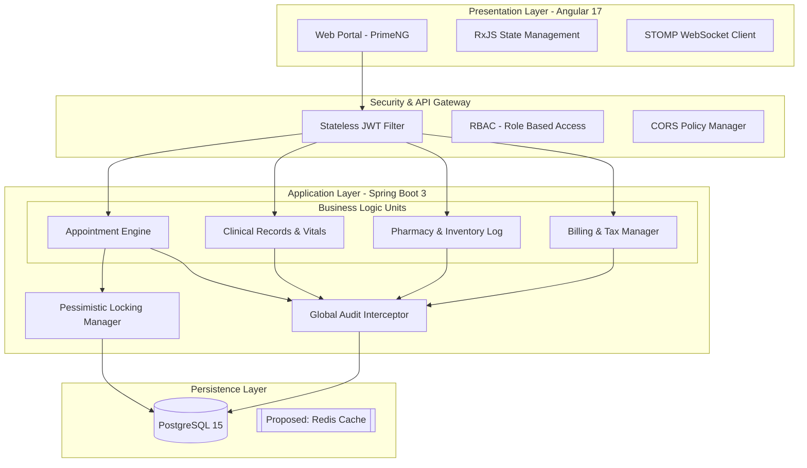
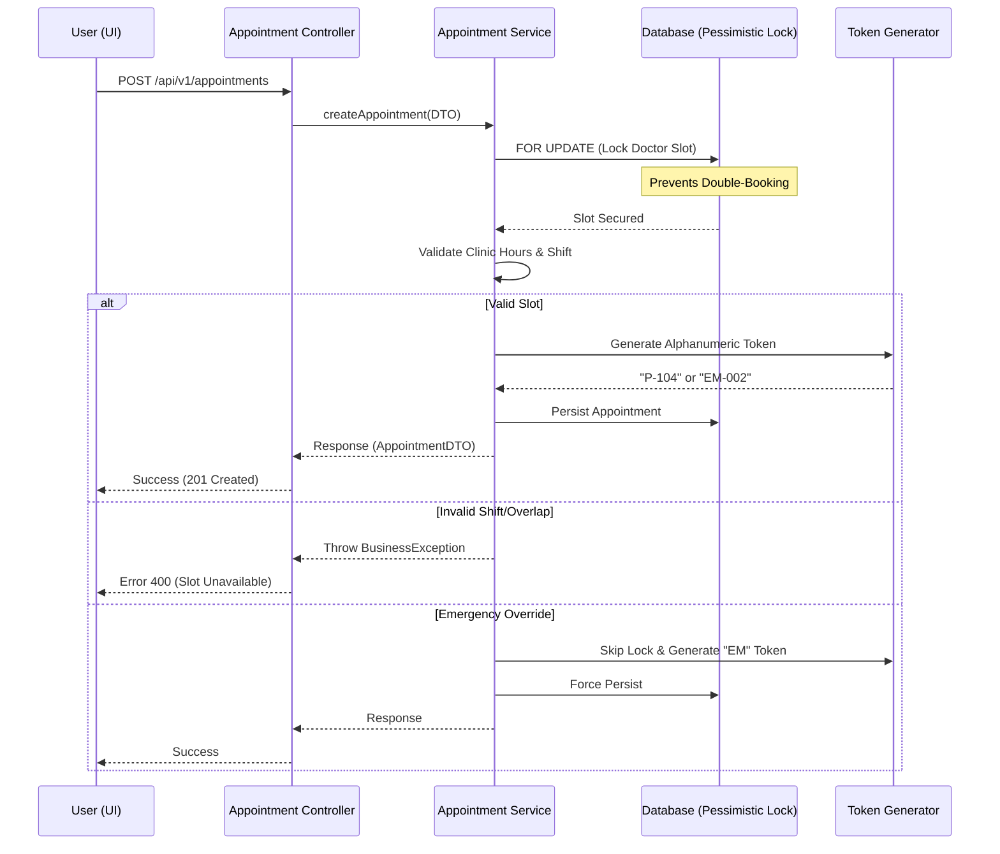

# 🏥 HMS Core - Unified Healthcare Operations Platform

A high-performance, production-ready Hospital Management System (HMS) architected for mission-critical medical environments. Built on **Spring Boot 3 (Java 17)** and **Angular 17**, it features real-time triage, industrial-grade concurrency protection, and automated financial workflows.

---

## 🏗️ System Design Architecture

The platform follows a distributed, modular monolith pattern designed for vertical scalability and high availability.

---

## 🔄 Interaction Flow: Appointment Booking
This sequence diagram illustrates the lifecycle of a patient booking, highlighting the **Concurrency Control** and **Token Generation** logic.

---

## 🌟 Professional Feature Set

### 🏥 Clinical Operations
*   **Intelligent Triage:** Automated token system (`P-` for Standard, `EM-` for Emergency) with override priority.
*   **Vitals Lifecycle:** Real-time patient monitoring (BP, SpO2, Pulse) with historical trend tracking.
*   **Digital Prescription Engine:** Linked directly to the Pharmacy catalog for instant medicine lookup.

### 💰 Revenue Cycle Management (Finance)
*   **GST Integrated Invoicing:** Automated 5% tax calculation and service-wise breakdown.
*   **Insurance/TPA Workflows:** Native support for claims numbers and insurance provider tracking.
*   **Global Export Center:** Audit-ready exports to Excel/CSV for all financial reports (Appointments, Patients, Medicine).

### 💊 Supply Chain & Pharmacy
*   **FIFO Inventory Log:** Strict transaction logging for every medicine issued or received.
*   **Low Stock Surveillance:** Automated identification of medicines falling below safety thresholds.

---

## 🛠️ Technology Stack & Patterns

| Layer | Technology | Key Implementation |
| :--- | :--- | :--- |
| **Frontend** | Angular 17+ | Standalone components, RxJS, PrimeNG Premium UI |
| **Backend** | Spring Boot 3.3 | RESTful Micro-controllers, Lombok, MapStruct |
| **Security** | Spring Security 6 | Stateless JWT, RBAC, Password Hashing |
| **Data** | PostgreSQL + JPA | Pessimistic Locking, Auditable Entities |
| **Real-time** | WebSocket (STOMP) | Live Dashboard stats and triage updates |

---

## 🚦 Getting Started

### Backend (Core API)
1. Ensure **JDK 17** and **Maven** are installed.
2. Update `backend/src/main/resources/application.properties` with PostgreSQL credentials.
3. Run: `mvn clean spring-boot:run`

### Frontend (User Interface)
1. Ensure **Node.js 18+** is installed.
2. `cd frontend && npm install`
3. Run: `ng serve` (Access at `http://localhost:4200`)

---

## 🔒 Reliability Engineering
*   **Atomic Transactions:** All critical medical records are wrapped in `@Transactional` to ensure zero data corruption.
*   **Audit Trail:** Every change is timestamped (UTC) and linked to the user via `Auditable` hooks.
*   **Soft Deletion:** Medical records are never purged; they use a `deleted` flag to maintain a lifetime audit history.
