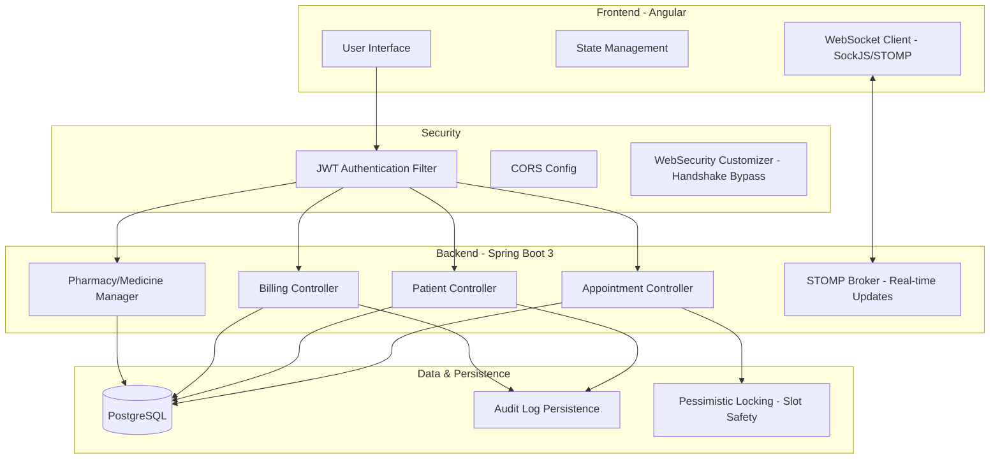
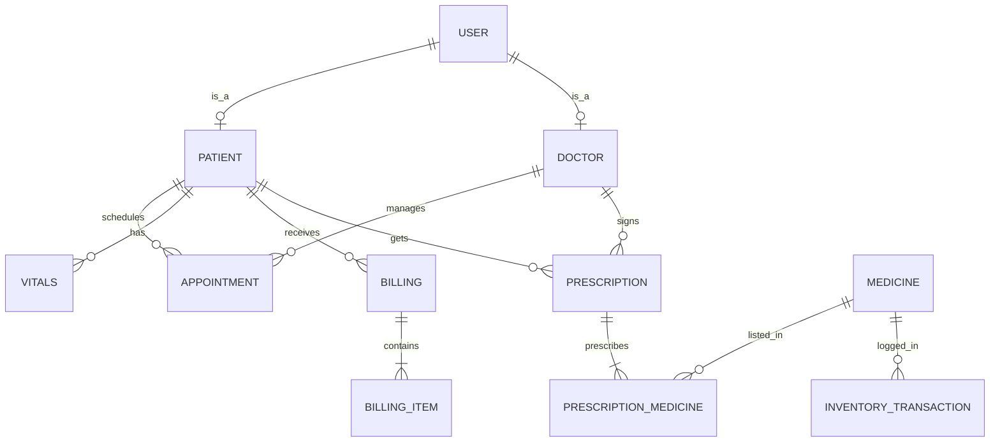

# 🏥 HMS - Advanced Full-Stack Hospital Management System

A production-grade, real-time Hospital Management System (HMS) built with **Spring Boot 3**, **Angular 17**, and **PostgreSQL**. Designed for high-reliability medical environments with concurrency protection, real-time triage, and automated clinical workflows.

---

## 🏗️ "System Architecture"

---

## 📊 Database Entity-Relationship (ER) Diagram

---

## 🌟 Key Features

### 📅 Advanced Appointment & Triage
*   **Real-time Dashboard**: Live updates when patients check in via WebSockets.
*   **Emergency Overrides**: "EM-" token system to squeeze urgent cases into full schedules.
*   **Pessimistic Slot Locking**: Prevents double-booking at the database level.
*   **Alphanumeric Tokens**: Professional `P-101` and `EM-005` queue tracking.

### 🩺 Clinical Management
*   **Digital Prescriptions**: Linked to pharmacy inventory with auto-lookup.
*   **Vitals Tracking**: Pulse, BP, Weight, and SpO2 history timeline.
*   **Doctor Workflow**: Status transitions from `SCHEDULED` → `CHECKED_IN` → `IN_CONSULTATION` → `COMPLETED`.

### 💊 Pharmacy & Inventory
*   **Live Stock Monitoring**: Real-time inventory logs with transaction history.
*   **Expiry Alerts**: Proactive identification of low-stock and near-expiry medicines.
*   **Prescription Integration**: Instant stock deduction upon medication issuance.

### 💰 Billing & Finance (Enterprise Grade)
*   **Automated GST**: Real-time 5% tax calculation integrated into invoices.
*   **Insurance/TPA Support**: Track claim numbers and insurance providers.
*   **Global Export**: One-click "Export to Excel" for audit and accounting.

---

## 🛠️ Advanced Production Patterns Implemented
1.  **Global Object Shims**: Managed compatibility for STOMP/SockJS in modern browser environments.
2.  **Spring Security Bypassing**: Custom `WebSecurityCustomizer` for high-performance WebSocket handshakes.
3.  **Auditable Entities**: Automated `createdAt`, `updatedAt`, and `createdBy` tracking for all medical records.

---

## 🖥️ Frontend Pages (Total: 10 Modules)
| Module | Primary Pages |
| :--- | :--- |
| **Dashboard** | Admin Overview, Doctor Queue, Patient Portal |
| **Appointments** | Live Schedule, Booking Form, Emergency Triage |
| **Patients** | Patient Directory, Profile View, Visit History |
| **Clinical** | Vitals Entry, Prescription Builder, Consultation Notes |
| **Pharmacy** | Medicine List, Inventory Logs, Stock Manager |
| **Billing** | Invoice List, Create Invoice, Insurance Tracker |
| **Staff** | Doctor Management, Schedule Planner |

---

## 🔌 Core API Endpoints

### Authentication
*   `POST /api/auth/login` - JWT Token generation
*   `POST /api/auth/register` - User onboarding

### Appointments
*   `GET /api/appointments` - All visits
*   `POST /api/appointments` - Book (with overlap checks)
*   `PATCH /api/appointments/{id}/status` - Workflow updates

### Medicine & Inventory
*   `GET /api/inventory/transactions` - Audit logs
*   `POST /api/medicines` - Manage medicine data

---

## 🚀 Getting Started

### Prerequisites
*   Java 17 / Maven
*   Node.js 18+ / Angular CLI
*   PostgreSQL 14+

### Backend Setup
1. Configure `src/main/resources/application.properties` with your DB credentials.
2. Run `./mvnw spring-boot:run`

### Frontend Setup
1. `cd hospital-frontend`
2. `npm install`
3. `ng serve` (Available at http://localhost:4200)

---

## 🗺️ Roadmap (Future Scope)
*   [ ] **Redis Caching**: To handle 10,000+ simultaneous availability checks.
*   [ ] **S3 Document Storage**: Move X-ray and Lab PDF files to encrypted cloud buckets.
*   [ ] **Full-Text Search**: Elasticsearch integration for patient clinical notes.
*   [ ] **Telemedicine**: Integrated WebRTC video consultations.
